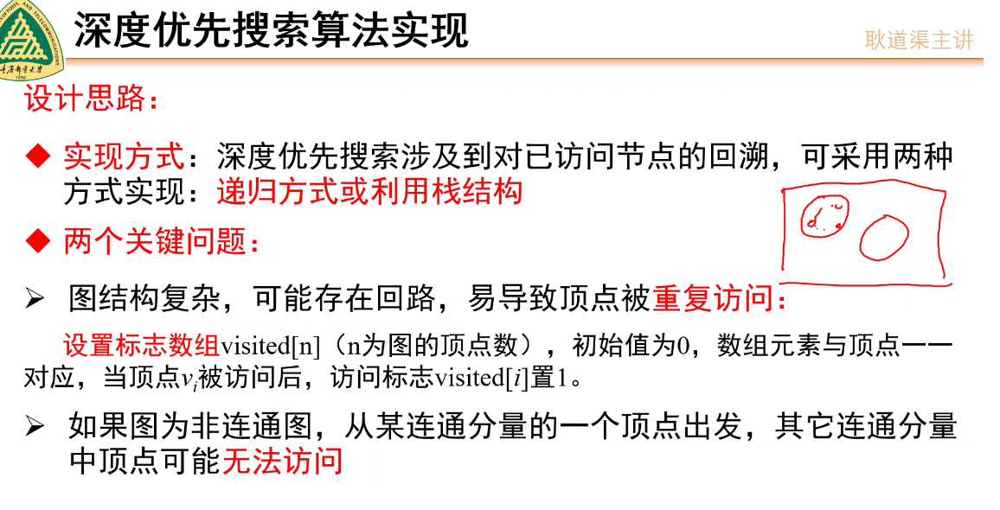
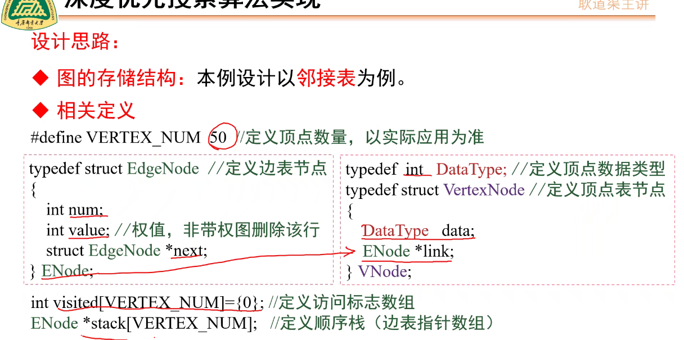
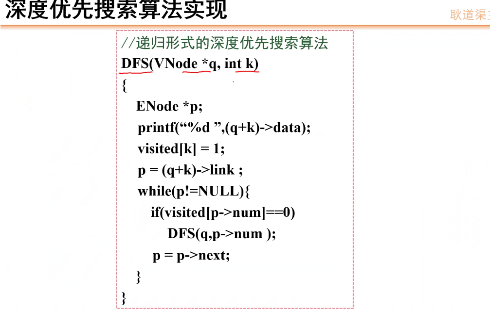
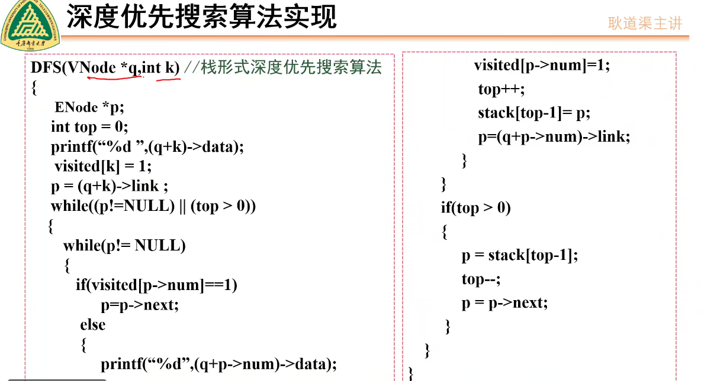
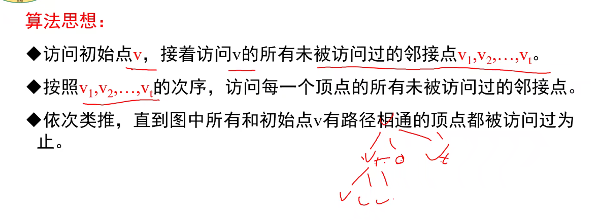

# 如何存储一个图

## 需要什么信息

- 顶点
- 顶点信息
- 顶点指针


## 如何存储

- 需要保证完整、准确的存储信息
- 形式:            领接矩阵、领接表
- 
### 领接矩阵

- 使用一个一维数组存储顶点信息
- 用一个二维数组(领接矩阵)存储图中边的信息(顶点间的的关联关系)
- 设 $G=(V，E)$
$$
    R[i][j] = 
            1,\\
            0
$$
 [](../img/nopointergra.png)
#### 无向图的领接矩阵

- 生成一个5X5的邻接矩阵
- image.png

- 对于无向图来说 对角线为0且为对称矩阵
- 领接矩阵中
- 、
##### 如何判断顶点间右边
-  $V_{ij}==1$


##### 如何求顶点$V_{ij}$的所有领接顶点
  - 通过第i行非0的值
 ```
     for(j= 0;j< n;j++) 

            if(R[i][j] == 1)

  ```
 
#### 有向图的领接矩阵

    [](./**../img/ljjz.png)
**

#### 有向图的领接矩阵是不是一定不对称

    当有向图双向联通时相当于无向图

#### 如何求顶点$V_{i}$的出度

    第i行非零元素的个数 
 [](./../img/CD.png)


#### 如何求顶点$V_{i}$的入度

    第i列非零元素的个数


### 带权图的领接矩阵

#### 定义： 

[](./../img/dqt.png）

[](./../img/dqt2.png）

#### 若图有n个顶点 e条边
- 领接表的空间复杂度为 O(n+2e)


#### 如何求领接表的度
- 遍历顶点 $V_{i}$中节点的个数
  
#### 如何利用领接表求顶点$V_{i}$所有的邻接点
- 遍历领接顶点 遍历$V_{i}$所有的节点并从num值从顶点表中输出相应的顶点
- XaS


#### 有向图通过领接表计算出度
- 如何利用领接表求顶点的入度

#### 有向图通过领接表计算入度

- 求指向以$v_{i}$为领接点的个数

#### 带权图通过领接表计算出度

#### 带权图通过领接表计算入度


#### 图的遍历(领接表)
- 遍历序列不唯一
 
- 深度优先搜索
  - 从一个点出发遍历所有邻接点 当所有邻接点被遍历后 
  - 单链表v0 v1 v2
  - 边表 遍历v1
  - 当节点所有邻接点均被访问后 原路回退到还有未访问节点的位置
   
  - 用for循环访问联通分量 使用遍历的形式访问
  - 遍历定义的标志数组
  - 基于访问标志循环遍历的每个联通分量
  - 
  - 递归实现 
  - 非递归实现 
    - visit 为标志数组
    - 标志数组
    - 将遍历过的节点序号和标志数组入栈 
    - 利用顺序栈逐个存放遍历历史
    - 只要栈非空 就出栈 直到所有节点访问
    - 非连通图DFS 
    - 遍历次数恰好是非联通图节点个数
- 广度优先搜素
  - 算法思想
    - 访问初始点v,接着访问v的所有未被访问过的邻接点v1,v2,...,vi
    - 
    - 
      - 通过访问标志数组 和while循环访问实现
        - 图的存储结构:本例设计以领接表为例
        - 
        - 